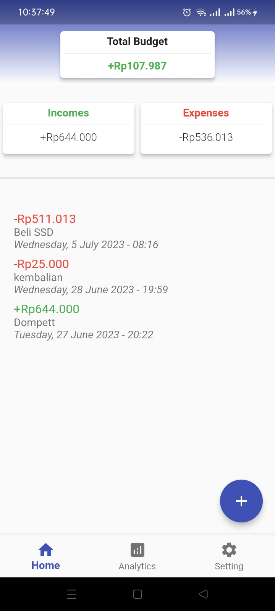
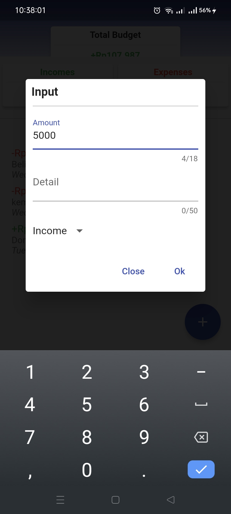
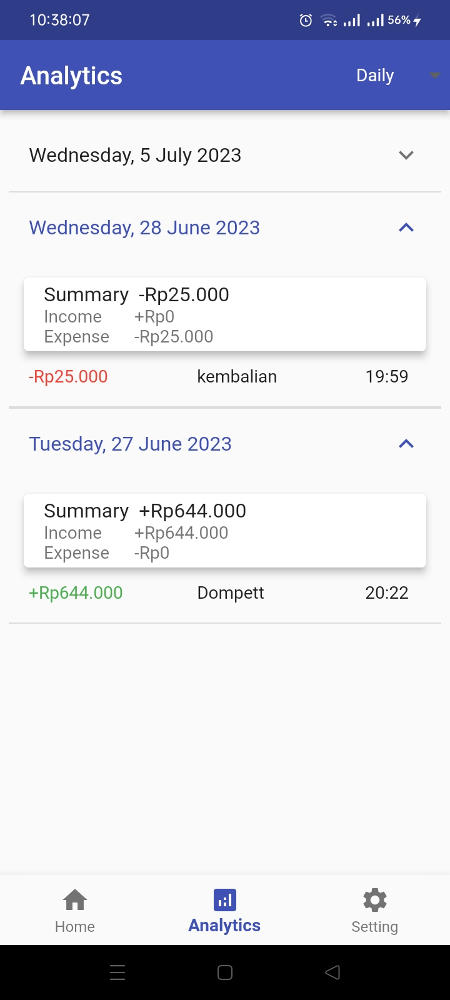
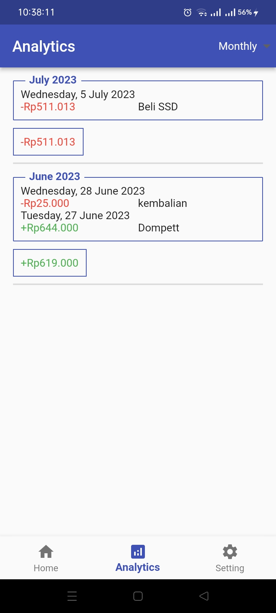
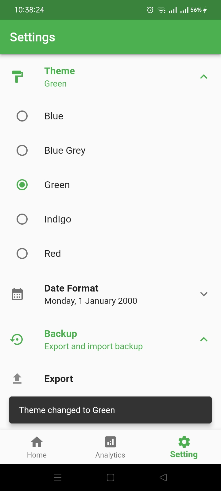

## budget_tracker
A simple app to keep track of your finances | Flutter  
State management using [Riverpod](https://riverpod.dev/)  
Store app settings using [SharedPreferences](https://pub.dev/packages/shared_preferences)  

## Screenshot
<table>
  <tbody>
    <tr>
      <td></td>
      <td></td>
      <td></td>
    </tr>
    <tr>
      <td></td>
      <td></td>
    </tr>
  </tbody>
</table>

## License 
[GPL-3.0](https://github.com/AghnatHs/budget_tracker/blob/main/LICENSE).